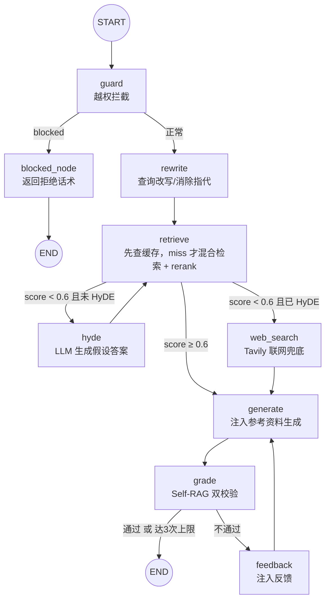
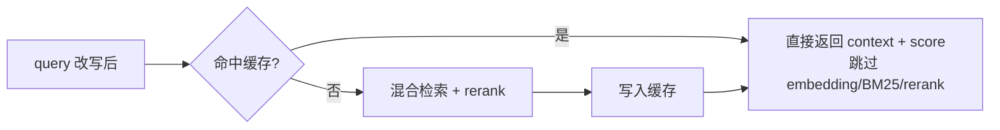
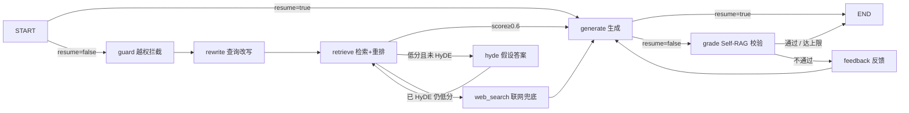
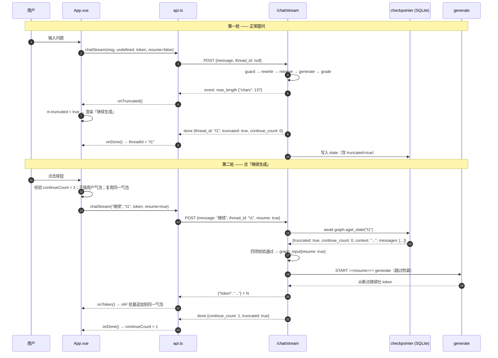

# doctor-agent —— 医疗问答 RAG + Agent

一个**生产级**的医疗问答 Agent：基于 **LangGraph** 编排的 RAG 流水线，融合了
混合检索、交叉编码重排、HyDE 假设答案二次检索、Self-RAG 自校验、越权拦截、
多轮查询改写（消除语义漂移）等企业级能力，并通过 **RAGAS** 做量化评测、用 **LLM 生成分析报告**。

> 一句话：用户提问 → 越权拦截 → 查询改写 → 检索（命中缓存直达 / 低分走 HyDE 二次检索 / 联网兜底）
> → 生成答案 → 自校验（不合格则重写），全程可测试、可评测、可观测。


---

## 一、核心能力

| 能力 | 说明 |
|---|---|
| 混合检索 | Pinecone 向量检索 + BM25 关键词检索（`EnsembleRetriever`，权重 0.6/0.4） |
| 交叉编码重排 | `CrossEncoder(ms-marco-MiniLM-L-6-v2)` + Sigmoid 激活，把 logits 映射到 0~1 概率分 |
| 检索结果缓存 | 高频问题命中内存 LRU+TTL+语义匹配缓存直达结果，跳过 embedding+BM25+rerank；`cache_hit/cache_reason/cache_mode` 写回 state 供链路追踪；HyDE 不参与缓存，向量库更新自动失效 |
| 确定性路由 | rerank top1 分数 ≥ `RAG_MIN_SCORE`(0.6) 走本地 RAG；低分先 HyDE 二次检索，仍低分才 Tavily 联网兜底 |
| HyDE 检索增强 | 低分时让 LLM 生成「假设答案」再检索，拉近查询与文档的语义距离；`hyde_done` 防死循环，生成失败 fail-open 回退联网 |
| Self-RAG 自校验 | 两个 grader：**幻觉校验**（答案是否基于检索事实）+ **答题校验**（是否解决用户问题），不合格带反馈重生成（最多 3 轮） |
| 越权守卫（Guard） | 在检索前拦截 6 类越权请求（开处方、伪造证明、自伤倾向、非医疗、色情暴力等） |
| 查询改写（Rewrite） | 多轮追问时把残句（"那会持续多久？"）改写成独立完整查询，消除**语义漂移** |
| HTTP API（FastAPI） | 提供 `/api/v1/chat` 接口，支持多轮会话（`thread_id` 记忆）与 Bearer Token 鉴权 |
| 流式对话（SSE） | `/api/v1/chat/stream` 逐 token 推送；前端用 rAF 批量渲染，首字延迟 / 渲染帧数可观测 |
| 截断续写 | 检测 `finish_reason == "length"` 推 `event: max_length`；前端「继续生成」复用同一 `thread_id`，后端从 checkpoint 取回上一轮检索结果、直连 `generate`（跳过 guard/rewrite/retrieve/grade） |
| 登录鉴权 | 账号密码登录换取 token；受保护接口校验 `Authorization: Bearer <token>`，比较用 `secrets.compare_digest` 防时序攻击 |
| RAGAS 评测 | 5 指标量化质量 + LLM 自动生成可交付的分析报告 |

---

## 二、技术栈

| 层 | 技术 |
|---|---|
| 语言/环境 | Python 3.13 + `uv` 包管理 |
| 编排 | LangGraph 1.2.11（`StateGraph` 状态机） |
| LLM | DeepSeek（`deepseek-chat`，经 `langchain-deepseek` 的 `init_chat_model`） |
| Embedding | 阿里云 DashScope `text-embedding-v3`（1024 维，自实现 `Embeddings` 接口） |
| 向量库 | Pinecone（索引 `demo`，1024 维，cosine，us-east-1） |
| 关键词检索 | BM25（`rank-bm25` / `langchain_community.BM25Retriever`） |
| 重排 | `sentence-transformers` CrossEncoder |
| 本地语义 Embedding | `sentence-transformers` `bge-small-zh-v1.5`（缓存语义匹配 key，毫秒级、无网络） |
| 联网搜索 | Tavily Search |
| 接口层 | FastAPI + Uvicorn（REST API、Bearer Token 鉴权、多轮会话） |
| 评测 | RAGAS 0.2.12（5 指标 + LLM 分析报告） |

---

## 三、目录结构

```
doctor-agent/
├── main.py                    # 应用入口（薄入口）：加载环境变量 → 组装图 → re-export
├── doctor_agent/              # 核心包（业务逻辑：12 个顶层模块 + nodes/ 子包）
│   ├── __init__.py            # 包文档 + 版本号
│   ├── config.py              # 全局配置中心（路径 / 阈值 / 模型名 / 开关）
│   ├── state.py               # LangGraph 图状态（State TypedDict）
│   ├── document_loader.py     # CSV 加载 / 清洗 / 切分 / 缓存
│   ├── embeddings.py          # DashScope embedding 封装
│   ├── vector_store.py        # Pinecone 初始化 + 增量写入
│   ├── retrieval.py           # 混合检索 + CrossEncoder 重排
│   ├── retrieval_cache.py     # 检索结果缓存（LRU + TTL）
│   ├── llm.py                 # LLM 工厂（生成 / 校验模型）
│   ├── prompts.py             # 所有提示词模板
│   ├── tools.py               # 检索工具 + Tavily + 消息辅助
│   ├── nodes/                 # 图节点（职责单一）
│   │   ├── guard.py           #   越权守卫
│   │   ├── rewrite.py         #   查询改写（语义漂移）
│   │   ├── retrieve.py        #   检索 + 路由
│   │   ├── hyde.py            #   HyDE 假设答案二次检索
│   │   ├── web_search.py      #   联网兜底
│   │   ├── generate.py        #   生成
│   │   └── grade.py           #   Self-RAG 校验
│   └── graph.py               # 图组装（build_graph）
├── api/                       # HTTP 接口层（FastAPI）
│   ├── app.py                 #   应用入口（加载 .env → 注册路由）
│   ├── schemas.py             #   请求/响应模型（Pydantic）
│   ├── deps.py                #   依赖注入（Bearer Token 校验）
│   ├── graph_instance.py      #   带 AsyncSqliteSaver 的图实例（多轮记忆 + 续写的基础）
│   ├── routers/
│   │   ├── auth.py            #   登录（/auth/login）
│   │   └── chat.py            #   对话（/chat 同步 + /chat/stream 流式 SSE + 续写前置校验）
│   └── services/
│       └── agent.py           #   封装 graph 调用（唯一与图交互处）
├── evaluate.py                # RAGAS 评测脚本（抽样本 → 检索生成 → 打分 → LLM 报告）
├── guard_eval.py              # 越权拦截测试（7 条用例，含 5 越权 + 2 正常对照）
├── test_semantic_drift.py     # 语义漂移对照实验（追问用例，开/关 rewrite 对比）
├── cache_test_suite.py        # 检索缓存企业级测试套件（12 用例 + 开关对照 + 风险探针，生成 md 报告）
├── api_smoke_test.py          # API 冒烟测试（验证多轮记忆是否生效）
├── auth_smoke_test.py         # 鉴权冒烟测试（401 / 登录发 token / 带 token 200）
├── retrieval_hit_rate_test.py # 查询改写对检索命中率的对照实验（实体命中率）
├── datas/
│   └── zhongliu.csv           # 肿瘤科问答数据（GB18030 编码，4 列）
├── prompts/
│   └── doctor_prompt.md       # 医生角色 system prompt（含安全规则 + 免责声明模板）
├── resources/
│   └── api_checkpoint.db      # 会话状态持久化（AsyncSqliteSaver；多轮记忆与续写都靠它）
├── pyproject.toml             # 依赖声明（uv）
├── langgraph.json             # LangGraph Server 配置（入口 ./main.py:graph）
├── cache/                     # 切分缓存（增量失效，避免重复切分）
├── .env                       # 密钥（不入库）
├── reports/                   # 测试报告输出（cache_test_report_*.md）
└── ragas_results.csv / ragas_report_*.md  # 评测输出
```

> 前端是**独立仓库**：[ctreyx/doctor-agent-web](https://github.com/ctreyx/doctor-agent-web)
> （Vue 3 + Vite + TypeScript + SCSS），通过 Vite dev server 代理 `/api` → `http://127.0.0.1:8001`。
> 本地开发时与本目录平级（`../doctor-agent-web`）；其流式消费与续写交互的实现细节见 **第九节**。

---

## 四、系统架构与处理流程



> `rewrite` 节点可用开关 `config.ENABLE_REWRITE` 跳过（用于对照实验复现语义漂移）。
> HyDE 通过 `state.hyde_done` 保证最多执行一次（防死循环）；开关 `config.HYDE_ENABLED`。
> `retrieve` 入口先查检索缓存（命中直达），miss 才走检索；细节见「七、检索结果缓存」。

---

## 五、State 状态字段

定义在 `doctor_agent/state.py` 的 `class State(TypedDict)`：

| 字段 | 类型 | 说明 |
|---|---|---|
| `messages` | `list[AnyMessage]`（`add_messages` reducer） | 对话历史，自动累积 |
| `context` | `str` | 检索参考资料（注入生成 prompt） |
| `score` | `float` | rerank top1 分数（用于路由） |
| `generation` | `str` | 当前生成的答案（供校验 + 测试读取） |
| `attempts` | `int` | 校验循环计数 |
| `passed` | `bool` | 校验是否通过 |
| `feedback` | `str` | 校验失败反馈（用于指导重生成） |
| `blocked` | `bool` | 是否被越权守卫拦截 |
| `block_reply` | `str` | 拦截时的合规回复话术 |
| `query` | `str` | 改写后的查询（解决语义漂移） |
| `hyde_done` | `bool` | 是否已执行过 HyDE（防死循环，最多一次） |
| `hyde_answer` | `str` | HyDE 生成的假设答案（用于二次检索） |
| `cache_hit` | `bool` | 本次检索是否命中缓存（True=命中并跳过整套检索） |
| `cache_reason` | `str` | 缓存命中原因：exact / semantic / miss / bypass_hyde / cache_disabled |
| `cache_mode` | `str` | 缓存开关状态：on / off |
| `resume` | `bool` | 本次是否为续写请求（True → START 直连 `generate`，跳过 guard/rewrite/retrieve/grade） |
| `truncated` | `bool` | 上一轮生成是否因 `max_tokens` 被截断（由 `generate` 写回并持久化，续写校验的依据） |
| `continue_count` | `int` | 本轮回答已续写次数（服务端防刷 + 控成本，上限 `CONTINUE_MAX_ROUNDS`） |

---

## 六、各模块详解

核心业务逻辑按职责拆分到 ``doctor_agent`` 包，每个模块单一职责：

| 模块 | 职责 | 关键内容 |
|---|---|---|
| `config.py` | 全局配置中心 | 所有路径、阈值、模型名、开关常量（唯一修改入口） |
| `state.py` | 图状态定义 | `State(TypedDict)`，15 个字段 |
| `document_loader.py` | 数据层 | `clean_text` / `load_csv_documents` / `get_documents`（惰性单例 + 磁盘缓存） |
| `embeddings.py` | Embedding | `DashScopeTextEmbeddingV3` + `get_embeddings`（惰性单例） |
| `vector_store.py` | 向量库 | `get_index`（惰性连接）/ `upsert_documents`（增量写入） |
| `retrieval.py` | 检索层 | `get_retrieval` / `rerank_documents` / `format_context` |
| `retrieval_cache.py` | 检索缓存 | `get_cached`（返回 context/score/reason）/ `set_cached` / `invalidate_cache` / `cache_stats`（LRU + TTL + 语义匹配） |
| `llm.py` | 模型工厂 | `get_llm`（生成）/ `get_grader_llm`（低温校验） |
| `prompts.py` | 提示词 | `SYSTEM_PROMPT` + 改写 / 守卫 / 校验模板 |
| `tools.py` | 工具 | `search_medical_knowledge` / `tavily_tool` / `latest_user_query` |
| `nodes/` | 图节点 | guard / rewrite / retrieve / hyde / web_search / generate / grade |
| `graph.py` | 图组装 | `build_graph()` 注册节点并连线 |

各层要点：

- **数据层**：`datas/zhongliu.csv`（GB18030 编码）清洗后按行解析成 `Document`；短答案整条保留，长答案按 `CHUNK_SIZE=500 / CHUNK_OVERLAP=80` 递归切分；`cache/` 用内容 hash 做增量失效，`index_manifest.json` 记录向量库写入清单。
- **检索层**：Pinecone 向量 + BM25 关键词 → `EnsembleRetriever`（权重 0.6/0.4）→ CrossEncoder（Sigmoid）重排 top3；所有重资源（模型下载、索引构建、连接）均惰性初始化，避免 Server 启动卡住。
- **检索缓存**：`retrieval_cache.py` 用内存 LRU + TTL + 本地 embedding 语义匹配缓存 `(context, score)`；命中直达跳过检索，HyDE 假设答案不参与缓存，向量库更新后 `invalidate_cache()` 全清；每次检索把 `cache_hit / cache_reason / cache_mode` 写回 state 供链路追踪。
- **生成层**：检索结果注入 system prompt（`prompts/doctor_prompt.md` + `【参考资料】`），历史上限 `MAX_MESSAGES=20`。
- **Self-RAG 校验**：`GradeHallucinations`（防幻觉）+ `GradeAnswer`（防答非所问），低温模型 `temperature=0`；不通过则 `feedback` 注入重生成，上限 `MAX_ATTEMPTS=3`。
- **越权守卫**：`GuardResult`（is_blocked/reason/reply）拦截 6 类越权请求，被拦截走 `blocked_node` 返回温和拒绝话术。
- **查询改写**：`rewrite_query_node` 把追问残句改写成完整查询；开关 `config.ENABLE_REWRITE`（True 走 rewrite，False 跳过复现漂移）。
- **HyDE 检索增强**：检索分数低于 `RAG_MIN_SCORE` 时，`hyde_node` 让 LLM 生成假设答案并覆盖 `query` 二次检索；`hyde_done` 标志保证最多一次，生成失败/为空时 fail-open 回退联网。

---

## 七、检索结果缓存（企业级）

### 1. 为什么缓存

检索链路（embedding + BM25 建索引 + CrossEncoder 重排）较重，高频问题（常见症状、
术后护理、用药禁忌等）重复完整检索既浪费算力、又增加首字延迟。缓存检索结果可显著
降低延迟与成本。

### 2. 原理

缓存位于 `retrieve_node` 入口，命中后直接返回上次的 `(context, score)`，跳过整套检索：



核心字段（`doctor_agent/retrieval_cache.py`）：

| 项 | 设计 |
|---|---|
| key | 规范化 query：`strip + 压缩空白 + 英文小写`，同一问题不同写法命中同一条目 |
| 语义匹配 | L1 精确 miss 后，用本地轻量 embedding（`bge-small-zh-v1.5`）+ 余弦相似度做 L2 匹配，解决「感冒吃什么药 vs 感冒如何治疗」类语义同义 |
| value | `(context, score, reason)`，检索结果拼装文本 + top1 分数 + 命中类型（下游 generate 只需 context/score） |
| 淘汰策略 | LRU：命中 `move_to_end`，写满淘汰最久未用条目——天然「保留高频、淘汰低频」 |
| 过期 | TTL：每条记录带过期时间戳，读取时惰性清理，医疗知识更新自动失效 |
| 并发 | `threading.Lock`，LangGraph Server 多线程下不脏读 |
| 失效 | `invalidate_cache()`：向量库 `upsert_documents` 写入后调用，全量清空 |

### 3. 企业级设计要点

| 设计点 | 实现 | 为什么 |
|---|---|---|
| 防缓存污染 | HyDE 假设答案不参与缓存（`hyde_done` 判断） | 假设答案每次由 LLM 生成、内容不稳定，写入永远不命中，还会挤占缓存 |
| 保留高频 | LRU `move_to_end` + 容量淘汰 | 频繁访问的条目不被淘汰，低频自然让位 |
| 数据一致性 | 向量库更新后 `invalidate_cache()` | 避免知识库更新后返回陈旧检索结果 |
| 过期可控 | TTL + 读取时惰性清理 | 过期条目不阻塞命中路径，无后台定时器 |
| 并发安全 | `threading.Lock` 保护读写 | Server 多线程并发下不脏读 |
| 可观测 | `cache_hit/cache_reason/cache_mode` 写入 state + `cache_stats()` + `[cache]` 日志 | 链路追踪直接看到命中状态，定位缓存是否生效、量化收益 |
| 可降级 | `RAG_CACHE_ENABLED` 开关 | 出问题一键关闭，不影响主流程 |

### 4. 如何测试

同一问题连跑两次（**必须用不同 `thread_id`**，否则 checkpoint 会复用上次结果），第二次应命中缓存：

```powershell
& ".\.venv\Scripts\python.exe" -c "import main as app; from doctor_agent.retrieval_cache import cache_stats; q={'messages':[{'role':'user','content':'肺癌早期有哪些症状'}]}; app.graph.invoke(q, config={'configurable':{'thread_id':'c1'}}); app.graph.invoke(q, config={'configurable':{'thread_id':'c2'}}); print(cache_stats())"
```

预期输出（第二次触发命中）：

```
[cache] 命中：肺癌早期有哪些症状… score=1.000
{'size': 1, 'hits': 1, 'misses': 1, 'hit_rate': 0.5}
```

- 第一次：miss，走完整检索并写入缓存；
- 第二次：`[cache] 命中`，直接返回缓存结果；
- `cache_stats()` 显示 `hits=1 / misses=1 / hit_rate=0.5`。

### 5. 在 LangSmith 追踪中查看命中

每次检索无论命中与否，`retrieve_node` 都会把 `cache_hit / cache_reason / cache_mode`
写回 state。开启 LangSmith 追踪后，展开一次会话 trace 的 `retrieve` 节点，
在 Outputs 里可直接看到这三个字段：

| 字段 | 命中时 | 未命中时 |
|---|---|---|
| `cache_hit` | `true` | `false` |
| `cache_reason` | `exact`（精确键）/ `semantic`（语义相似） | `miss` / `bypass_hyde` / `cache_disabled` |
| `cache_mode` | `on` | `on` / `off` |

前提：`.env` 中开启 `LANGSMITH_TRACING=true` 并配置 `LANGSMITH_API_KEY`。

---

## 八、HTTP API（FastAPI）

除 LangGraph Server 外，项目还提供独立的 REST 接口层（`api/`），供前端调用。

### 1. 接口一览

| 方法 | 路径 | 鉴权 | 说明 |
|---|---|---|---|
| GET | `/health` | 否 | 健康检查 |
| POST | `/api/v1/auth/login` | 否 | 登录，返回 access token |
| POST | `/api/v1/chat` | ✅ Bearer | 对话（一次性返回完整答案，支持多轮记忆） |
| POST | `/api/v1/chat/stream` | ✅ Bearer | **流式对话（SSE）**，逐 token 推送，支持截断续写，详见第九节 |

### 2. 登录鉴权

账号密码校验通过后返回 token，受保护接口需带请求头 `Authorization: Bearer <token>`。

- 默认账号：`admin` / `admin@123`（见 `config.AUTH_USERNAME` / `AUTH_PASSWORD`）
- Token：`config.AUTH_TOKEN`（当前为演示用固定值，**生产应换 JWT**）
- 安全细节：凭据与 token 比较用 `secrets.compare_digest`（常量时间），避免时序攻击

### 3. 多轮对话记忆

多轮记忆 = **checkpointer + `thread_id`**：

- `api/graph_instance.py` 用 `AsyncSqliteSaver` 编译带持久化的图（`astream` 是异步的，同步 `SqliteSaver` 会抛 `NotImplementedError`；与 LangGraph Server 的图分开，避免两套 checkpointer 冲突）
- 请求体传同一个 `thread_id` → LangGraph 自动加载**上一轮完整 state**（`messages` / `context` / `query` / `score` 全部恢复）→ `rewrite` 节点可做指代消解
- 这个机制同时是**截断续写**的基础：续写请求复用同一 `thread_id`，后端不做检索即可拿到上一轮的 `context`（详见第九节）

```json
{ "message": "那会持续多久？", "thread_id": "t1" }
```

> 响应里的 `query` 字段是**改写后的检索查询**，可用来验证记忆是否生效：
> 第 2 轮追问 `那会持续多久？` → `query` 应变成 `化疗后恶心会持续多久？`

### 4. 注意事项

| 项 | 说明 |
|---|---|
| 必须先加载 `.env` | `api/app.py` 顶部 `load_dotenv()` 必须在导入 `doctor_agent` 前执行（`tools.py` 导入时就要用 `TAVILY_API_KEY`） |
| state 必须可序列化 | checkpointer 用 msgpack 序列化 state，**numpy 类型会报错**；`rerank_documents` 已把分数转为 Python `float` |
| 单 worker | SQLite checkpointer 与内存缓存都不支持多进程共享，多实例需换 Postgres + Redis |

---

## 九、流式输出与断点续写（截断 → 继续生成）

### 1. 要解决的问题

LLM 单次输出受 `max_tokens` 限制。长回答会被**硬截断**——停在半句话中间，
但前端看起来像是"答完了"，用户拿不到完整内容。

先把三个容易混淆的概念分清：

| 常见误解 | 实际情况 |
|---|---|
| "接口限制了传给前端的 token 数" | ❌ SSE 走 `Transfer-Encoding: chunked`，没有 `Content-Length`，**传输层无任何 token 上限** |
| "模型已经答完了" | ❌ `finish_reason == "length"` 表示撞到了 `max_tokens` 上限，不是自然结束 |
| "缓存上次结果，下次直接拉" | ❌ 缓存的是**完整回答**；被截断的回答本身残缺，缓存下来还是残缺的 |

> 补充：`finish_reason` 其他取值 —— `stop`（正常说完）/ `content_filter`（内容安全拦截）/ `tool_calls`（要调工具）。

**业界的分层解法**（由治本到补救）：

| 层 | 做法 | 适用 |
|---|---|---|
| L0 | 抬高 `max_tokens`（DeepSeek 上限 8192） | 所有场景，第一优先 |
| L1 | 流式输出 + 客户端拼接 | 基线 |
| L2 | **续写（continuation）**——把半截答案留在上下文里让模型接着写 | 交互式对话（本项目） |
| L3 | 服务端响应持久化 + `response_id` 拉取 | 托管平台（OpenAI Responses API） |
| L4 | Outline → 分章节生成 | 长报告 / Deep Research 类产品 |

本项目实现 **L2**。其中 L3 在 LangGraph 体系里等价于 **checkpointer + `thread_id`**，
本项目已经具备，续写正是建立在这个能力之上。

### 2. 后端链路

#### 2.1 SSE 事件协议

`POST /api/v1/chat/stream` 按 SSE 格式推送四类消息：

| 事件名 | payload | 时机 |
|---|---|---|
| （默认） | `{"token": "增量文本"}` | 每收到一个 generate 节点的增量 token |
| `event: max_length` | `{"reason": "length", "chars": 1234}` | 检测到 `finish_reason == "length"` |
| （默认） | `{"done": true, "thread_id": "...", "query": "...", "cache_hit": false, "cache_reason": "miss", "truncated": true, "continue_count": 0}` | 流正常结束 |
| （默认） | `{"error": "服务暂时不可用，请稍后重试", "trace_id": "..."}` | 异常收尾 |

> 两个工程细节：
> - `truncated` 在 `done` 里**冗余带一份**，避免 `max_length` 事件在网络分包边界丢失导致前端漏判
> - 流一旦开始，HTTP 状态码已经发出，**错误只能以事件形式收尾**；且不回显 `type(e).__name__` 等内部信息，详情只进服务端日志

#### 2.2 请求体

```json
{ "message": "继续", "thread_id": "web-1", "resume": true }
```

| 字段 | 类型 | 说明 |
|---|---|---|
| `message` | `str` | 1~2000 字符 |
| `thread_id` | `str \| None` | 不传则新建会话 |
| `resume` | `bool` | `true` = 续写上一轮被截断的回答 |

#### 2.3 图的双入口

`doctor_agent/graph.py` 为 `START` 增加条件路由，并让 `generate` 的出口分流：



- `route_entry()`：`state["resume"]` 为真 → 直连 `generate`，否则走 `guard`
- `route_after_generate()`：续写生成完**直接 END**，不跑 Self-RAG 校验
  （否则 `grade` 不通过会触发 `feedback → generate` 把整段回答重写一遍，续写就白做了）

#### 2.4 为什么"跳过检索"是成立的

关键在于 **checkpointer 恢复的不只是 `messages`**：

```python
# 续写请求只传了 messages 和 resume 两个入参
graph.astream(
    {"messages": [HumanMessage("继续")], "resume": True, "continue_count": 1},
    config={"configurable": {"thread_id": "web-1"}},
)
```

LangGraph 先按 `thread_id` 从 `resources/api_checkpoint.db` 读出上一轮 state，
再用 reducer 合并入参。于是 `generate` 节点读到的：

```python
context = state.get("context")      # ← 上一轮的检索结果，原样还在
resp = get_llm().invoke([sys_msg] + state["messages"][-config.MAX_MESSAGES:])
                                # ↑ 包含上一条被截断的 AIMessage
```

模型看到"自己上一条说到一半" + "用户让我继续"，自然接着写。

**"从哪里开始"不需要任何显式游标——半截答案本身就是上下文。**

同时省掉的调用：

| 节点 | 首次提问 | 续写 |
|---|---|---|
| guard（越权判定 LLM） | ✅ | **跳过** |
| rewrite（查询改写 LLM） | ✅ | **跳过** |
| retrieve（embedding + BM25 + CrossEncoder 重排） | ✅ | **跳过** |
| generate（生成 LLM） | ✅ | ✅（唯一保留） |
| grade + feedback（Self-RAG 校验 LLM） | ✅ | **跳过** |
| **总 LLM 调用次数** | 4~5 | **1** |

#### 2.5 `truncated` 落库

续写请求的合法性由服务端判定，**不能信客户端**。因此 `generate_node` 必须把截断状态写回 state：

```python
finish = (resp.response_metadata or {}).get("finish_reason")
return {
    "messages": [resp],
    "generation": resp.content,
    "truncated": finish == "length",   # ← 由 checkpointer 持久化
}
```

> 不落库的话，后端就"不知道"上一轮是否被截断，`aget_state` 拿不到该字段，
> 所有续写请求都会被 409 拒绝。

#### 2.6 续写前置校验

`api/routers/chat.py` 在建立流之前先读 checkpoint 做四项校验：

| HTTP | 触发条件 | detail |
|---|---|---|
| 400 | `resume=true` 但没带 `thread_id` | 续写必须携带 thread_id |
| 409 | 该 thread 没有 `messages` | 该会话没有可续写的内容 |
| 409 | 上一轮 `truncated` 不为真 | 上一轮回答未被截断，无需续写 |
| 429 | `continue_count >= CONTINUE_MAX_ROUNDS` | 本轮最多续写 3 次 |

校验通过后组装入参：

```python
graph_input = {
    "messages": [HumanMessage(content=config.CONTINUE_PROMPT)],
    "resume": True,                    # ← 决定走 generate 捷径
    "continue_count": done + 1,        # ← 计数落库，供下次校验
}
```

`CONTINUE_PROMPT` 专门要求"先补完被切断的那句，不要重复已出现过的文字，不要加过渡语"。

### 3. 前端链路

前端是**独立仓库**：[ctreyx/doctor-agent-web](https://github.com/ctreyx/doctor-agent-web)
（Vue 3 + Vite + TypeScript；本地开发时与本目录平级，即 `../doctor-agent-web`）。

调用链：`Vite dev server (5173)` → `proxy /api` → `FastAPI (8001)`。

#### 3.1 分层职责

| 文件 | 层 | 职责 |
|---|---|---|
| `src/api.ts` | 传输层 | `streamOnce` 单次 SSE 请求 + 解析；`chatStream` 重试包装 |
| `src/App.vue` | 消费层 | `runStream` 统一流式入口；`continueFrom` 续写触发 |

#### 3.2 `api.ts` —— 事件名解析

SSE 一个 block 可能有多行（`event:` / `data:`），原生 `EventSource` 又不支持 `POST`、
不能带 `Authorization` 头、不支持 `AbortSignal`，所以用 `fetch` + `ReadableStream` 手写解析：

```ts
for (const raw of part.split("\n")) {
  const line = raw.trim();
  if (line.startsWith("event:")) eventName = line.slice(6).trim();
  else if (line.startsWith("data:")) dataLine = line.slice(5).trim();
}
const obj = JSON.parse(dataLine);
if (eventName === "max_length") { h.onTruncated?.(obj); continue; }   // ← 独立事件
if (obj.token !== undefined) h.onToken(obj.token);
else if (obj.done) { sawDone = true; h.onDone(obj); }
else if (obj.error) { h.onError(obj.error); return; }
```

- 解析器按 `\n\n` 切分消息，**最后一段可能不完整，留在 buffer 里等下一轮拼接**
- `sawDone` 守卫：流结束仍未收到 `done` → 抛错交给外层重连
- 401 → 清 `localStorage` 的 token；其他 4xx/5xx → 解析后端 `detail` 并标记 `err.fatal = true`，
  **外层不再退避重试**（业务错误重试只会白等）

#### 3.3 `App.vue` —— `runStream` 统一入口

把原来的 `send()` 抽成 `runStream(o: RunOpts)`，普通提问与续写共用同一套流式处理：

```ts
interface RunOpts {
  text: string;
  resume?: boolean;     // 透传给后端，决定走完整链路还是 generate 捷径
  showUser?: boolean;   // false = 不渲染用户气泡（续写时用）
  targetIdx?: number;   // 指定写入哪个气泡（续写时复用同一个）
}
```

`send()` 和 `continueFrom()` 都只是它的薄封装：

```ts
function send() {
  const text = input.value.trim();
  if (!text) return;
  input.value = "";
  runStream({ text, showUser: true });
}

function continueFrom(idx: number) {
  if (loading.value) return;
  const m = messages.value[idx];
  if ((m.continueCount ?? 0) >= CONTINUE_MAX_ROUNDS) {          // 本地先拦一次
    retryHint.value = `本轮最多续写 ${CONTINUE_MAX_ROUNDS} 次，请直接追问新问题`;
    return;
  }
  m.truncated = false;
  runStream({ text: "继续", resume: true, showUser: false, targetIdx: idx });
}
```

#### 3.4 续写时的状态处理

| 项 | 处理 |
|---|---|
| `truncated` | `onTruncated` 置 `true`；`onDone` 里再用 `info.truncated` **兜底**一次 |
| `continueCount` | 以服务端 `done` 事件回传的 `continue_count` 为准（前端本地计数只用于提前拦截） |
| `meta`（缓存命中信息） | 续写**不覆盖**——检索信息来自上一轮，不是这次产生的 |
| `onRetry` | 清空气泡内容。当前重试是「重新生成」而非真·断点续传，不清空会重复 |

#### 3.5 渲染与截断提示

| 项 | 实现 |
|---|---|
| 批量渲染 | `onToken` 只往 `buffer` 里攒，用 `requestAnimationFrame` 每帧 flush 一次，避免每个 token 触发一次响应式更新 |
| 截断提示 | 气泡内渲染 `.truncated-bar`（橙色提示 + 「继续生成」按钮） |
| 按钮禁用 | `loading`（生成中）或 `continueCount >= 3`（达上限）时置灰 |
| 性能观测 | Console 输出 `[性能]首答/续写 tokens / 渲染次数 / 首字延迟 / 总耗时` |

### 4. 完整时序



### 5. 设计取舍

| 决策 | 原因 |
|---|---|
| 续写不显示用户气泡 | 「继续」是系统指令，不是用户输入，显示出来会污染对话 |
| 续写复用同一气泡 | 续写内容是同一条回答的延续，新开气泡会把回答切成碎片 |
| 续写跳过 Self-RAG 校验 | 校验不通过会触发重生成，把整段回答重写，续写等于白做 |
| **不做对话摘要** | 半截答案还在 `messages` 里，模型自己会接着写；只有 `messages` 超出上下文窗口时才需要摘要（当前 `MAX_MESSAGES=20`，约 10 轮，短期内够用） |
| 续写次数上限 3 | 续写成本是**平方级**增长：每续一次上下文就长一截（2k→6k→10k→14k），无上限会导致成本和延迟爆炸 |
| 复用显式指令而非 prefill | DeepSeek 走 OpenAI 兼容协议，**不支持真正的 assistant prefill**（末尾 assistant 消息会被理解成"已说完"）。Anthropic / vLLM 才有 prefill，效果更好但此处不可用 |

### 6. 已知风险与待补

| 级别 | 项 | 说明 |
|---|---|---|
| 🟠 | **Overlap 重复** | 显式指令路线下模型有小概率把上一段结尾重说一遍，前端拼起来是肉眼可见的重复段落。需要服务端做重叠裁剪（比较 `prev` 结尾与 `new` 开头的最长公共子串并裁掉） |
| 🟠 | **重试非真续传** | `onRetry` 走的是「重新生成 + 前端清空」，网络抖动会重烧 token。真正的不重复烧 token 需要服务端 token 缓冲（按 `stream_id` 缓存已产出文本）+ 客户端带 `offset` 重连 |
| 🟠 | **IDOR** | 续写校验读取 checkpoint 时**未校验 `thread_id` 归属**，任意登录用户可续写/读取他人会话。应把 `thread_id` 改为 `{user}:{uuid}` 前缀并校验 |
| 🟡 | 无速率限制 | `/chat/stream` 无频率限制，续写可被用来放大 token 消耗（当前只有 3 次上限兜底） |
| 🟡 | 调试残留 | `doctor_agent/llm.py` 的 `max_tokens=50` 是测试截断用的，**上线前必须改回默认值** |

### 7. 如何测试

因为需要构造超长输出才能触发截断，最快的办法是把 `max_tokens` 临时调小：

```python
# doctor_agent/llm.py —— 仅测试用，测完删除
_llm = init_chat_model(config.LLM_MODEL, max_tokens=50)
```

然后：

| 步骤 | 预期 |
|---|---|
| 1. 登录后随便问一句 | 回答 1 秒内停住，气泡下方出现橙色 `⚠️ 内容较长，已被截断` + 「继续生成」 |
| 2. F12 → Network → `stream` → Payload | `{ "message": "...", "thread_id": "...", "resume": false }` |
| 3. 点「继续生成」 | **不出现用户气泡**；内容追加在**同一气泡**内 |
| 4. 后端日志 | **完全没有** `[cache] 命中`，也没有检索 / 重排输出 |
| 5. F12 → Network → `stream` → Payload | `{ "message": "继续", "thread_id": "...", "resume": true }` |
| 6. Console 性能日志 | `[性能]续写 ... 首字: 0.4Xs`（应显著低于首答的 1.5~3s） |
| 7. 连点 4 次 | 第 4 次按钮置灰 + 提示「已达续写上限，请追问新问题」 |

也可以直接在 Network 面板的 EventStream 里看原始帧：

```
event: max_length
data: {"reason":"length","chars":137}
```

**失败特征速查**：

| 现象 | 原因 |
|---|---|
| `AttributeError: 'dict' object has no attribute 'CONTINUE_MAX_ROUNDS'` | `chat.py` 里局部变量 `config` 覆盖了模块名，应改用 `run_config` |
| `NameError: name 'logger' is not defined` | 缺 `logger = logging.getLogger(__name__)`（只在异常分支触发，平时看不出来） |
| `409 上一轮回答未被截断` | `generate_node` 没有把 `truncated` 写回 state |
| 续写首字仍然 2 秒以上 | 请求没带 `resume: true`，后端仍走完整链路 |

### 8. 涉及文件

| 文件 | 改动 |
|---|---|
| `doctor_agent/config.py` | `CONTINUE_ENABLED` / `CONTINUE_MAX_ROUNDS` / `CONTINUE_PROMPT` |
| `doctor_agent/state.py` | 新增 `resume` / `truncated` / `continue_count` |
| `doctor_agent/nodes/generate.py` | 把 `truncated` 写回 state（供 checkpointer 持久化） |
| `doctor_agent/graph.py` | `route_entry` + `route_after_generate`，START 条件入口、generate 出口分流 |
| `api/schemas.py` | `ChatRequest.resume` |
| `api/routers/chat.py` | 续写前置校验、`graph_input` 分支、`event: max_length` 推送 |
| `doctor-agent-web/src/api.ts` | `resume` 透传、SSE `event:` 名解析、错误分类（`fatal`） |
| `doctor-agent-web/src/App.vue` | `runStream` 统一入口、`continueFrom`、截断提示与上限拦截 |
| `doctor-agent-web/src/style.css` | `.truncated-bar` / `.continue-btn` / `.truncated-hint` |

---

## 十、运行方式

### 1. 环境准备

`.env` 需要以下密钥：

```ini
DASHSCOPE_API_KEY=xxx   # 阿里云 DashScope（embedding）
PINECONE_API_KEY=xxx    # 向量库
DEEPSEEK_API_KEY=xxx    # LLM
TAVILY_API_KEY=xxx      # 联网搜索
# 可选：链路追踪（要在 LangSmith 看缓存命中时，把 TRACING 设为 true 并配置 key）
LANGSMITH_TRACING_V2=false
LANGSMITH_API_KEY=xxx
LANGSMITH_PROJECT=doctor-agent
HF_ENDPOINT=https://hf-mirror.com
```

安装依赖：

```powershell
uv sync
```

### 2. 运行测试

```powershell
# 越权拦截测试（7 条用例）
& ".\.venv\Scripts\python.exe" guard_eval.py

# 语义漂移对照实验（12 条追问用例，开/关 rewrite 对比）
& ".\.venv\Scripts\python.exe" test_semantic_drift.py

# RAGAS 评测（抽 5 条样本，固定随机种子）
& ".\.venv\Scripts\python.exe" evaluate.py --n 5 --seed 42

# HyDE 检索增强测试（强制走 hyde：临时把阈值提到 2.0，观察 [hyde] 日志与 hyde_answer）
& ".\.venv\Scripts\python.exe" -c "import doctor_agent.config as cfg; cfg.RAG_MIN_SCORE=2.0; import main as app; r=app.graph.invoke({'messages':[{'role':'user','content':'肺癌术后如何护理'}]}, config={'configurable':{'thread_id':'hyde-1'}}); print('=== hyde_answer ==='); print(r.get('hyde_answer','(未触发)')[:120]); print('=== score ===', r.get('score'))"

# 检索缓存测试（同一问题两次、不同 thread_id，第二次命中缓存）
& ".\.venv\Scripts\python.exe" -c "import main as app; from doctor_agent.retrieval_cache import cache_stats; q={'messages':[{'role':'user','content':'肺癌早期有哪些症状'}]}; app.graph.invoke(q, config={'configurable':{'thread_id':'c1'}}); app.graph.invoke(q, config={'configurable':{'thread_id':'c2'}}); print(cache_stats())"

# 检索缓存企业级测试套件（12 用例 + 缓存开关对照 + 风险探针，自动生成 md 报告）
& ".\.venv\Scripts\python.exe" cache_test_suite.py --cache-mode both
例子： 感冒需要吃什么药  和 感冒应该吃什么药
```

### 3. 启动 LangGraph Server

```powershell
.\.venv\Scripts\langgraph.exe dev --port 8123
```

入口由 `langgraph.json` 指定为 `./main.py:graph`。

### 4. 启动 HTTP API（FastAPI）

```powershell
& ".\.venv\Scripts\python.exe" -m uvicorn api.app:app --port 8001 --reload
```

- 交互式文档：http://127.0.0.1:8001/docs
- 建议加 `--reload`（改后端代码自动重载，避免「改了代码但服务仍跑旧逻辑」）
- 冒烟测试（需服务已启动）：
  - `& ".\.venv\Scripts\python.exe" api_smoke_test.py` —— 多轮记忆
  - `& ".\.venv\Scripts\python.exe" auth_smoke_test.py` —— 登录鉴权

---

## 十一、评测（RAGAS）

`evaluate.py` 做五维量化评测：

| 指标 | 及格线 | 含义 |
|---|---|---|
| Faithfulness | 0.9 | 答案是否基于检索事实（防幻觉，医学场景最关键） |
| Answer Correctness | 0.8 | 答案是否正确 |
| Context Recall | 0.8 | 检索是否漏掉关键信息 |
| Context Precision | 0.7 | 检索是否带回无关内容 |
| Answer Relevancy | 0.7 | 答案是否紧扣问题 |

评测完成后：
1. 各指标均值打印到终端
2. 明细保存 `ragas_results.csv`
3. **LLM 自动生成分析报告**保存为 `ragas_report_YYYYMMDD_HHMMSS.md`（含逐指标诊断 + 最差样本剖析 + 修复建议）

---

## 十二、关键参数速查

| 参数 | 位置 | 值 |
|---|---|---|
| `RAG_MIN_SCORE` | `config.py` | 0.6（低于此值走联网） |
| `LLM_MODEL` | `config.py` | `deepseek:deepseek-chat`（生成模型） |
| `GRADER_TEMPERATURE` | `config.py` | 0.0（校验模型低温，保证判定稳定） |
| `MAX_ATTEMPTS` | `config.py` | 3（Self-RAG 重试上限） |
| `ENABLE_REWRITE` | `config.py` | True（语义漂移开关） |
| `HYDE_ENABLED` | `config.py` | True（低分 HyDE 二次检索开关） |
| `RAG_CACHE_ENABLED` | `config.py` | True（检索结果缓存开关） |
| `RAG_CACHE_MAX_SIZE` | `config.py` | 256（LRU 容量上限） |
| `RAG_CACHE_TTL` | `config.py` | 86400 秒 / 24h（缓存有效期） |
| `RAG_CACHE_EMBED_MODEL` | `config.py` | `bge-small-zh-v1.5`（本地轻量语义 embedding） |
| `RAG_CACHE_SEMANTIC_THRESHOLD` | `config.py` | 0.92（语义匹配余弦阈值，宁高勿低） |
| `CHUNK_SIZE` / `CHUNK_OVERLAP` | `config.py` | 500 / 80 |
| `EMBEDDING_DIMENSION` | `config.py` | 1024（与 Pinecone 索引一致） |
| `RETRIEVAL_K` / `RERANK_TOP_N` | `config.py` | 10 / 3 |
| `ENSEMBLE_WEIGHTS` | `config.py` | 向量 0.6 : BM25 0.4 |
| `RERANK_MODEL_NAME` | `config.py` | `cross-encoder/ms-marco-MiniLM-L-6-v2`（重排模型） |
| `TAVILY_MAX_RESULTS` | `config.py` | 5（联网搜索条数） |
| `MAX_MESSAGES` | `config.py` | 20（传给 LLM 的历史上限） |
| `PROCESS_VERSION` | `config.py` | "v1"（切分逻辑改动 +1 使缓存失效） |
| `IS_IMPORT_ENABLED` | `config.py` | False（是否写向量库） |
| `AUTH_USERNAME` | `config.py` | `admin`（登录账号） |
| `AUTH_PASSWORD` | `config.py` | `admin@123`（登录密码） |
| `AUTH_TOKEN` | `config.py` | 固定假 token（演示用；生产应换 JWT） |
| `CONTINUE_ENABLED` | `config.py` | True（截断续写开关） |
| `CONTINUE_MAX_ROUNDS` | `config.py` | 3（同一轮回答最多续写次数，防刷 + 控成本；前端 `App.vue` 的 `CONTINUE_MAX_ROUNDS` 需与之保持一致） |
| `CONTINUE_PROMPT` | `config.py` | 续写指令（要求先补完被切断的句子、不重复、不加过渡语） |

---

## 十三、相关仓库

| 仓库 | 说明 |
|---|---|
| `ctreyx/doctor-agent` | 本仓库：LangGraph RAG Agent + FastAPI 后端 |
| [ctreyx/doctor-agent-web](https://github.com/ctreyx/doctor-agent-web) | 前端：Vue 3 + Vite + TypeScript 对话界面（流式消费、截断续写、Markdown 渲染） |

### 接口契约对照

前后端约定由本仓库的 `api/schemas.py` / `api/routers/chat.py` ↔ 前端 `src/api.ts` 对齐：

| 契约 | 后端 | 前端 |
|---|---|---|
| 续写开关 | `ChatRequest.resume` | `StreamOptions.resume` → 请求体 `resume` |
| 续写次数上限 | `config.CONTINUE_MAX_ROUNDS` | `App.vue` 的 `CONTINUE_MAX_ROUNDS` |
| 截断事件 | `chat.py` 的 `_sse(..., event="max_length")` | `api.ts` 解析 `event: max_length` |
| 结束事件字段 | `done` 事件 payload | `StreamInfo` 接口 |

> ⚠️ 改契约时三处要同步：后端 `schemas.py`、前端 `api.ts`、双端的 `CONTINUE_MAX_ROUNDS`。

---

## 十四、License

[MIT](./LICENSE) © 2026 ctrey
