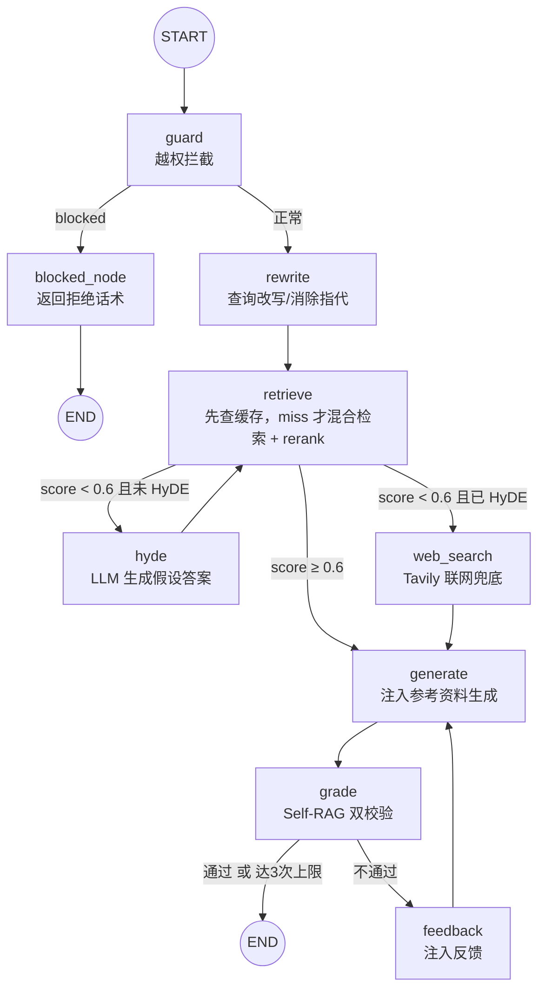
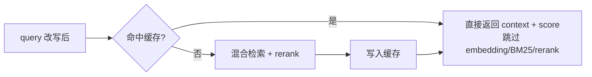

# doctor-agent —— 医疗问答 RAG + Agent

一个**生产级**的医疗问答 Agent：基于 **LangGraph** 编排的 RAG 流水线，融合了
混合检索、交叉编码重排、HyDE 假设答案二次检索、Self-RAG 自校验、越权拦截、
多轮查询改写（消除语义漂移）等企业级能力，并通过 **RAGAS** 做量化评测、用 **LLM 生成分析报告**。

> 一句话：用户提问 → 越权拦截 → 查询改写 → 检索（命中缓存直达 / 低分走 HyDE 二次检索 / 联网兜底）
> → 生成答案 → 自校验（不合格则重写），全程可测试、可评测、可观测。


---

## 一、核心能力

| 能力 | 说明 |
|---|---|
| 混合检索 | Pinecone 向量检索 + BM25 关键词检索（`EnsembleRetriever`，权重 0.6/0.4） |
| 交叉编码重排 | `CrossEncoder(ms-marco-MiniLM-L-6-v2)` + Sigmoid 激活，把 logits 映射到 0~1 概率分 |
| 检索结果缓存 | 高频问题命中内存 LRU+TTL+语义匹配缓存直达结果，跳过 embedding+BM25+rerank；`cache_hit/cache_reason/cache_mode` 写回 state 供链路追踪；HyDE 不参与缓存，向量库更新自动失效 |
| 确定性路由 | rerank top1 分数 ≥ `RAG_MIN_SCORE`(0.6) 走本地 RAG；低分先 HyDE 二次检索，仍低分才 Tavily 联网兜底 |
| HyDE 检索增强 | 低分时让 LLM 生成「假设答案」再检索，拉近查询与文档的语义距离；`hyde_done` 防死循环，生成失败 fail-open 回退联网 |
| Self-RAG 自校验 | 两个 grader：**幻觉校验**（答案是否基于检索事实）+ **答题校验**（是否解决用户问题），不合格带反馈重生成（最多 3 轮） |
| 越权守卫（Guard） | 在检索前拦截 6 类越权请求（开处方、伪造证明、自伤倾向、非医疗、色情暴力等） |
| 查询改写（Rewrite） | 多轮追问时把残句（"那会持续多久？"）改写成独立完整查询，消除**语义漂移** |
| RAGAS 评测 | 5 指标量化质量 + LLM 自动生成可交付的分析报告 |

---

## 二、技术栈

| 层 | 技术 |
|---|---|
| 语言/环境 | Python 3.13 + `uv` 包管理 |
| 编排 | LangGraph 1.2.11（`StateGraph` 状态机） |
| LLM | DeepSeek（`deepseek-chat`，经 `langchain-deepseek` 的 `init_chat_model`） |
| Embedding | 阿里云 DashScope `text-embedding-v3`（1024 维，自实现 `Embeddings` 接口） |
| 向量库 | Pinecone（索引 `demo`，1024 维，cosine，us-east-1） |
| 关键词检索 | BM25（`rank-bm25` / `langchain_community.BM25Retriever`） |
| 重排 | `sentence-transformers` CrossEncoder |
| 本地语义 Embedding | `sentence-transformers` `bge-small-zh-v1.5`（缓存语义匹配 key，毫秒级、无网络） |
| 联网搜索 | Tavily Search |
| 评测 | RAGAS 0.2.12（5 指标 + LLM 分析报告） |

---

## 三、目录结构

```
doctor-agent/
├── main.py                    # 应用入口（薄入口）：加载环境变量 → 组装图 → re-export
├── doctor_agent/              # 核心包（业务逻辑：12 个顶层模块 + nodes/ 子包）
│   ├── __init__.py            # 包文档 + 版本号
│   ├── config.py              # 全局配置中心（路径 / 阈值 / 模型名 / 开关）
│   ├── state.py               # LangGraph 图状态（State TypedDict）
│   ├── document_loader.py     # CSV 加载 / 清洗 / 切分 / 缓存
│   ├── embeddings.py          # DashScope embedding 封装
│   ├── vector_store.py        # Pinecone 初始化 + 增量写入
│   ├── retrieval.py           # 混合检索 + CrossEncoder 重排
│   ├── retrieval_cache.py     # 检索结果缓存（LRU + TTL）
│   ├── llm.py                 # LLM 工厂（生成 / 校验模型）
│   ├── prompts.py             # 所有提示词模板
│   ├── tools.py               # 检索工具 + Tavily + 消息辅助
│   ├── nodes/                 # 图节点（职责单一）
│   │   ├── guard.py           #   越权守卫
│   │   ├── rewrite.py         #   查询改写（语义漂移）
│   │   ├── retrieve.py        #   检索 + 路由
│   │   ├── hyde.py            #   HyDE 假设答案二次检索
│   │   ├── web_search.py      #   联网兜底
│   │   ├── generate.py        #   生成
│   │   └── grade.py           #   Self-RAG 校验
│   └── graph.py               # 图组装（build_graph）
├── evaluate.py                # RAGAS 评测脚本（抽样本 → 检索生成 → 打分 → LLM 报告）
├── guard_eval.py              # 越权拦截测试（7 条用例，含 5 越权 + 2 正常对照）
├── test_semantic_drift.py     # 语义漂移对照实验（追问用例，开/关 rewrite 对比）
├── cache_test_suite.py        # 检索缓存企业级测试套件（12 用例 + 开关对照 + 风险探针，生成 md 报告）
├── datas/
│   └── zhongliu.csv           # 肿瘤科问答数据（GB18030 编码，4 列）
├── prompts/
│   └── doctor_prompt.md       # 医生角色 system prompt（含安全规则 + 免责声明模板）
├── pyproject.toml             # 依赖声明（uv）
├── langgraph.json             # LangGraph Server 配置（入口 ./main.py:graph）
├── cache/                     # 切分缓存（增量失效，避免重复切分）
├── .env                       # 密钥（不入库）
├── reports/                   # 测试报告输出（cache_test_report_*.md）
└── ragas_results.csv / ragas_report_*.md  # 评测输出
```

---

## 四、系统架构与处理流程



> `rewrite` 节点可用开关 `config.ENABLE_REWRITE` 跳过（用于对照实验复现语义漂移）。
> HyDE 通过 `state.hyde_done` 保证最多执行一次（防死循环）；开关 `config.HYDE_ENABLED`。
> `retrieve` 入口先查检索缓存（命中直达），miss 才走检索；细节见「七、检索结果缓存」。

---

## 五、State 状态字段

定义在 `doctor_agent/state.py` 的 `class State(TypedDict)`：

| 字段 | 类型 | 说明 |
|---|---|---|
| `messages` | `list[AnyMessage]`（`add_messages` reducer） | 对话历史，自动累积 |
| `context` | `str` | 检索参考资料（注入生成 prompt） |
| `score` | `float` | rerank top1 分数（用于路由） |
| `generation` | `str` | 当前生成的答案（供校验 + 测试读取） |
| `attempts` | `int` | 校验循环计数 |
| `passed` | `bool` | 校验是否通过 |
| `feedback` | `str` | 校验失败反馈（用于指导重生成） |
| `blocked` | `bool` | 是否被越权守卫拦截 |
| `block_reply` | `str` | 拦截时的合规回复话术 |
| `query` | `str` | 改写后的查询（解决语义漂移） |
| `hyde_done` | `bool` | 是否已执行过 HyDE（防死循环，最多一次） |
| `hyde_answer` | `str` | HyDE 生成的假设答案（用于二次检索） |
| `cache_hit` | `bool` | 本次检索是否命中缓存（True=命中并跳过整套检索） |
| `cache_reason` | `str` | 缓存命中原因：exact / semantic / miss / bypass_hyde / cache_disabled |
| `cache_mode` | `str` | 缓存开关状态：on / off |

---

## 六、各模块详解

核心业务逻辑按职责拆分到 ``doctor_agent`` 包，每个模块单一职责：

| 模块 | 职责 | 关键内容 |
|---|---|---|
| `config.py` | 全局配置中心 | 所有路径、阈值、模型名、开关常量（唯一修改入口） |
| `state.py` | 图状态定义 | `State(TypedDict)`，15 个字段 |
| `document_loader.py` | 数据层 | `clean_text` / `load_csv_documents` / `get_documents`（惰性单例 + 磁盘缓存） |
| `embeddings.py` | Embedding | `DashScopeTextEmbeddingV3` + `get_embeddings`（惰性单例） |
| `vector_store.py` | 向量库 | `get_index`（惰性连接）/ `upsert_documents`（增量写入） |
| `retrieval.py` | 检索层 | `get_retrieval` / `rerank_documents` / `format_context` |
| `retrieval_cache.py` | 检索缓存 | `get_cached`（返回 context/score/reason）/ `set_cached` / `invalidate_cache` / `cache_stats`（LRU + TTL + 语义匹配） |
| `llm.py` | 模型工厂 | `get_llm`（生成）/ `get_grader_llm`（低温校验） |
| `prompts.py` | 提示词 | `SYSTEM_PROMPT` + 改写 / 守卫 / 校验模板 |
| `tools.py` | 工具 | `search_medical_knowledge` / `tavily_tool` / `latest_user_query` |
| `nodes/` | 图节点 | guard / rewrite / retrieve / hyde / web_search / generate / grade |
| `graph.py` | 图组装 | `build_graph()` 注册节点并连线 |

各层要点：

- **数据层**：`datas/zhongliu.csv`（GB18030 编码）清洗后按行解析成 `Document`；短答案整条保留，长答案按 `CHUNK_SIZE=500 / CHUNK_OVERLAP=80` 递归切分；`cache/` 用内容 hash 做增量失效，`index_manifest.json` 记录向量库写入清单。
- **检索层**：Pinecone 向量 + BM25 关键词 → `EnsembleRetriever`（权重 0.6/0.4）→ CrossEncoder（Sigmoid）重排 top3；所有重资源（模型下载、索引构建、连接）均惰性初始化，避免 Server 启动卡住。
- **检索缓存**：`retrieval_cache.py` 用内存 LRU + TTL + 本地 embedding 语义匹配缓存 `(context, score)`；命中直达跳过检索，HyDE 假设答案不参与缓存，向量库更新后 `invalidate_cache()` 全清；每次检索把 `cache_hit / cache_reason / cache_mode` 写回 state 供链路追踪。
- **生成层**：检索结果注入 system prompt（`prompts/doctor_prompt.md` + `【参考资料】`），历史上限 `MAX_MESSAGES=20`。
- **Self-RAG 校验**：`GradeHallucinations`（防幻觉）+ `GradeAnswer`（防答非所问），低温模型 `temperature=0`；不通过则 `feedback` 注入重生成，上限 `MAX_ATTEMPTS=3`。
- **越权守卫**：`GuardResult`（is_blocked/reason/reply）拦截 6 类越权请求，被拦截走 `blocked_node` 返回温和拒绝话术。
- **查询改写**：`rewrite_query_node` 把追问残句改写成完整查询；开关 `config.ENABLE_REWRITE`（True 走 rewrite，False 跳过复现漂移）。
- **HyDE 检索增强**：检索分数低于 `RAG_MIN_SCORE` 时，`hyde_node` 让 LLM 生成假设答案并覆盖 `query` 二次检索；`hyde_done` 标志保证最多一次，生成失败/为空时 fail-open 回退联网。

---

## 七、检索结果缓存（企业级）

### 1. 为什么缓存

检索链路（embedding + BM25 建索引 + CrossEncoder 重排）较重，高频问题（常见症状、
术后护理、用药禁忌等）重复完整检索既浪费算力、又增加首字延迟。缓存检索结果可显著
降低延迟与成本。

### 2. 原理

缓存位于 `retrieve_node` 入口，命中后直接返回上次的 `(context, score)`，跳过整套检索：



核心字段（`doctor_agent/retrieval_cache.py`）：

| 项 | 设计 |
|---|---|
| key | 规范化 query：`strip + 压缩空白 + 英文小写`，同一问题不同写法命中同一条目 |
| 语义匹配 | L1 精确 miss 后，用本地轻量 embedding（`bge-small-zh-v1.5`）+ 余弦相似度做 L2 匹配，解决「感冒吃什么药 vs 感冒如何治疗」类语义同义 |
| value | `(context, score, reason)`，检索结果拼装文本 + top1 分数 + 命中类型（下游 generate 只需 context/score） |
| 淘汰策略 | LRU：命中 `move_to_end`，写满淘汰最久未用条目——天然「保留高频、淘汰低频」 |
| 过期 | TTL：每条记录带过期时间戳，读取时惰性清理，医疗知识更新自动失效 |
| 并发 | `threading.Lock`，LangGraph Server 多线程下不脏读 |
| 失效 | `invalidate_cache()`：向量库 `upsert_documents` 写入后调用，全量清空 |

### 3. 企业级设计要点

| 设计点 | 实现 | 为什么 |
|---|---|---|
| 防缓存污染 | HyDE 假设答案不参与缓存（`hyde_done` 判断） | 假设答案每次由 LLM 生成、内容不稳定，写入永远不命中，还会挤占缓存 |
| 保留高频 | LRU `move_to_end` + 容量淘汰 | 频繁访问的条目不被淘汰，低频自然让位 |
| 数据一致性 | 向量库更新后 `invalidate_cache()` | 避免知识库更新后返回陈旧检索结果 |
| 过期可控 | TTL + 读取时惰性清理 | 过期条目不阻塞命中路径，无后台定时器 |
| 并发安全 | `threading.Lock` 保护读写 | Server 多线程并发下不脏读 |
| 可观测 | `cache_hit/cache_reason/cache_mode` 写入 state + `cache_stats()` + `[cache]` 日志 | 链路追踪直接看到命中状态，定位缓存是否生效、量化收益 |
| 可降级 | `RAG_CACHE_ENABLED` 开关 | 出问题一键关闭，不影响主流程 |

### 4. 如何测试

同一问题连跑两次（**必须用不同 `thread_id`**，否则 checkpoint 会复用上次结果），第二次应命中缓存：

```powershell
& ".\.venv\Scripts\python.exe" -c "import main as app; from doctor_agent.retrieval_cache import cache_stats; q={'messages':[{'role':'user','content':'肺癌早期有哪些症状'}]}; app.graph.invoke(q, config={'configurable':{'thread_id':'c1'}}); app.graph.invoke(q, config={'configurable':{'thread_id':'c2'}}); print(cache_stats())"
```

预期输出（第二次触发命中）：

```
[cache] 命中：肺癌早期有哪些症状… score=1.000
{'size': 1, 'hits': 1, 'misses': 1, 'hit_rate': 0.5}
```

- 第一次：miss，走完整检索并写入缓存；
- 第二次：`[cache] 命中`，直接返回缓存结果；
- `cache_stats()` 显示 `hits=1 / misses=1 / hit_rate=0.5`。

### 5. 在 LangSmith 追踪中查看命中

每次检索无论命中与否，`retrieve_node` 都会把 `cache_hit / cache_reason / cache_mode`
写回 state。开启 LangSmith 追踪后，展开一次会话 trace 的 `retrieve` 节点，
在 Outputs 里可直接看到这三个字段：

| 字段 | 命中时 | 未命中时 |
|---|---|---|
| `cache_hit` | `true` | `false` |
| `cache_reason` | `exact`（精确键）/ `semantic`（语义相似） | `miss` / `bypass_hyde` / `cache_disabled` |
| `cache_mode` | `on` | `on` / `off` |

前提：`.env` 中开启 `LANGSMITH_TRACING=true` 并配置 `LANGSMITH_API_KEY`。

---

## 八、运行方式

### 1. 环境准备

`.env` 需要以下密钥：

```ini
DASHSCOPE_API_KEY=xxx   # 阿里云 DashScope（embedding）
PINECONE_API_KEY=xxx    # 向量库
DEEPSEEK_API_KEY=xxx    # LLM
TAVILY_API_KEY=xxx      # 联网搜索
# 可选：链路追踪（要在 LangSmith 看缓存命中时，把 TRACING 设为 true 并配置 key）
LANGSMITH_TRACING_V2=false
LANGSMITH_API_KEY=xxx
LANGSMITH_PROJECT=doctor-agent
HF_ENDPOINT=https://hf-mirror.com
```

安装依赖：

```powershell
uv sync
```

### 2. 运行测试

```powershell
# 越权拦截测试（7 条用例）
& ".\.venv\Scripts\python.exe" guard_eval.py

# 语义漂移对照实验（12 条追问用例，开/关 rewrite 对比）
& ".\.venv\Scripts\python.exe" test_semantic_drift.py

# RAGAS 评测（抽 5 条样本，固定随机种子）
& ".\.venv\Scripts\python.exe" evaluate.py --n 5 --seed 42

# HyDE 检索增强测试（强制走 hyde：临时把阈值提到 2.0，观察 [hyde] 日志与 hyde_answer）
& ".\.venv\Scripts\python.exe" -c "import doctor_agent.config as cfg; cfg.RAG_MIN_SCORE=2.0; import main as app; r=app.graph.invoke({'messages':[{'role':'user','content':'肺癌术后如何护理'}]}, config={'configurable':{'thread_id':'hyde-1'}}); print('=== hyde_answer ==='); print(r.get('hyde_answer','(未触发)')[:120]); print('=== score ===', r.get('score'))"

# 检索缓存测试（同一问题两次、不同 thread_id，第二次命中缓存）
& ".\.venv\Scripts\python.exe" -c "import main as app; from doctor_agent.retrieval_cache import cache_stats; q={'messages':[{'role':'user','content':'肺癌早期有哪些症状'}]}; app.graph.invoke(q, config={'configurable':{'thread_id':'c1'}}); app.graph.invoke(q, config={'configurable':{'thread_id':'c2'}}); print(cache_stats())"

# 检索缓存企业级测试套件（12 用例 + 缓存开关对照 + 风险探针，自动生成 md 报告）
& ".\.venv\Scripts\python.exe" cache_test_suite.py --cache-mode both
例子： 感冒需要吃什么药  和 感冒应该吃什么药
```

### 3. 启动 LangGraph Server

```powershell
.\.venv\Scripts\langgraph.exe dev --port 8123
```

入口由 `langgraph.json` 指定为 `./main.py:graph`。

---

## 九、评测（RAGAS）

`evaluate.py` 做五维量化评测：

| 指标 | 及格线 | 含义 |
|---|---|---|
| Faithfulness | 0.9 | 答案是否基于检索事实（防幻觉，医学场景最关键） |
| Answer Correctness | 0.8 | 答案是否正确 |
| Context Recall | 0.8 | 检索是否漏掉关键信息 |
| Context Precision | 0.7 | 检索是否带回无关内容 |
| Answer Relevancy | 0.7 | 答案是否紧扣问题 |

评测完成后：
1. 各指标均值打印到终端
2. 明细保存 `ragas_results.csv`
3. **LLM 自动生成分析报告**保存为 `ragas_report_YYYYMMDD_HHMMSS.md`（含逐指标诊断 + 最差样本剖析 + 修复建议）

---

## 十、关键参数速查

| 参数 | 位置 | 值 |
|---|---|---|
| `RAG_MIN_SCORE` | `config.py` | 0.6（低于此值走联网） |
| `LLM_MODEL` | `config.py` | `deepseek:deepseek-chat`（生成模型） |
| `GRADER_TEMPERATURE` | `config.py` | 0.0（校验模型低温，保证判定稳定） |
| `MAX_ATTEMPTS` | `config.py` | 3（Self-RAG 重试上限） |
| `ENABLE_REWRITE` | `config.py` | True（语义漂移开关） |
| `HYDE_ENABLED` | `config.py` | True（低分 HyDE 二次检索开关） |
| `RAG_CACHE_ENABLED` | `config.py` | True（检索结果缓存开关） |
| `RAG_CACHE_MAX_SIZE` | `config.py` | 256（LRU 容量上限） |
| `RAG_CACHE_TTL` | `config.py` | 86400 秒 / 24h（缓存有效期） |
| `RAG_CACHE_EMBED_MODEL` | `config.py` | `bge-small-zh-v1.5`（本地轻量语义 embedding） |
| `RAG_CACHE_SEMANTIC_THRESHOLD` | `config.py` | 0.92（语义匹配余弦阈值，宁高勿低） |
| `CHUNK_SIZE` / `CHUNK_OVERLAP` | `config.py` | 500 / 80 |
| `EMBEDDING_DIMENSION` | `config.py` | 1024（与 Pinecone 索引一致） |
| `RETRIEVAL_K` / `RERANK_TOP_N` | `config.py` | 10 / 3 |
| `ENSEMBLE_WEIGHTS` | `config.py` | 向量 0.6 : BM25 0.4 |
| `RERANK_MODEL_NAME` | `config.py` | `cross-encoder/ms-marco-MiniLM-L-6-v2`（重排模型） |
| `TAVILY_MAX_RESULTS` | `config.py` | 5（联网搜索条数） |
| `MAX_MESSAGES` | `config.py` | 20（传给 LLM 的历史上限） |
| `PROCESS_VERSION` | `config.py` | "v1"（切分逻辑改动 +1 使缓存失效） |
| `IS_IMPORT_ENABLED` | `config.py` | False（是否写向量库） |

---
