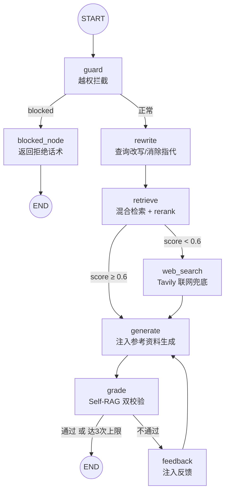

# doctor-agent —— 医疗问答 RAG + Agent

一个**生产级**的医疗问答 Agent：基于 **LangGraph** 编排的 RAG 流水线，融合了
混合检索、交叉编码重排、Self-RAG 自校验、越权拦截、多轮查询改写（消除语义漂移）等企业级能力，
并通过 **RAGAS** 做量化评测、用 **LLM 生成分析报告**。

> 一句话：用户提问 → 越权拦截 → 查询改写 → 混合检索/联网兜底 → 生成答案 → 自校验（不合格则重写），
> 全程可测试、可评测、可观测。


---

## 一、核心能力

| 能力 | 说明 |
|---|---|
| 混合检索 | Pinecone 向量检索 + BM25 关键词检索（`EnsembleRetriever`，权重 0.6/0.4） |
| 交叉编码重排 | `CrossEncoder(ms-marco-MiniLM-L-6-v2)` + Sigmoid 激活，把 logits 映射到 0~1 概率分 |
| 确定性路由 | rerank top1 分数 ≥ `RAG_MIN_SCORE`(0.6) 走本地 RAG，否则 Tavily 联网兜底 |
| Self-RAG 自校验 | 两个 grader：**幻觉校验**（答案是否基于检索事实）+ **答题校验**（是否解决用户问题），不合格带反馈重生成（最多 3 轮） |
| 越权守卫（Guard） | 在检索前拦截 6 类越权请求（开处方、伪造证明、自伤倾向、非医疗、色情暴力等） |
| 查询改写（Rewrite） | 多轮追问时把残句（"那会持续多久？"）改写成独立完整查询，消除**语义漂移** |
| RAGAS 评测 | 5 指标量化质量 + LLM 自动生成可交付的分析报告 |

---

## 二、技术栈

| 层 | 技术 |
|---|---|
| 语言/环境 | Python 3.13 + `uv` 包管理 |
| 编排 | LangGraph 1.2.11（`StateGraph` 状态机） |
| LLM | DeepSeek（`deepseek-chat`，经 `langchain-deepseek` 的 `init_chat_model`） |
| Embedding | 阿里云 DashScope `text-embedding-v3`（1024 维，自实现 `Embeddings` 接口） |
| 向量库 | Pinecone（索引 `demo`，1024 维，cosine，us-east-1） |
| 关键词检索 | BM25（`rank-bm25` / `langchain_community.BM25Retriever`） |
| 重排 | `sentence-transformers` CrossEncoder |
| 联网搜索 | Tavily Search |
| 评测 | RAGAS 0.2.12（5 指标 + LLM 分析报告） |

---

## 三、目录结构

```
doctor-agent/
├── main.py                    # 应用入口（薄入口）：加载环境变量 → 组装图 → re-export
├── doctor_agent/              # 核心包（业务逻辑，14 个模块）
│   ├── __init__.py            # 包文档 + 版本号
│   ├── config.py              # 全局配置中心（路径 / 阈值 / 模型名 / 开关）
│   ├── state.py               # LangGraph 图状态（State TypedDict）
│   ├── document_loader.py     # CSV 加载 / 清洗 / 切分 / 缓存
│   ├── embeddings.py          # DashScope embedding 封装
│   ├── vector_store.py        # Pinecone 初始化 + 增量写入
│   ├── retrieval.py           # 混合检索 + CrossEncoder 重排
│   ├── llm.py                 # LLM 工厂（生成 / 校验模型）
│   ├── prompts.py             # 所有提示词模板
│   ├── tools.py               # 检索工具 + Tavily + 消息辅助
│   ├── nodes/                 # 图节点（职责单一）
│   │   ├── guard.py           #   越权守卫
│   │   ├── rewrite.py         #   查询改写（语义漂移）
│   │   ├── retrieve.py        #   检索 + 路由
│   │   ├── web_search.py      #   联网兜底
│   │   ├── generate.py        #   生成
│   │   └── grade.py           #   Self-RAG 校验
│   └── graph.py               # 图组装（build_graph）
├── evaluate.py                # RAGAS 评测脚本（抽样本 → 检索生成 → 打分 → LLM 报告）
├── guard_eval.py              # 越权拦截测试（7 条用例，含 5 越权 + 2 正常对照）
├── test_semantic_drift.py     # 语义漂移对照实验（追问用例，开/关 rewrite 对比）
├── datas/
│   └── zhongliu.csv           # 肿瘤科问答数据（GB18030 编码，4 列）
├── prompts/
│   └── doctor_prompt.md       # 医生角色 system prompt（含安全规则 + 免责声明模板）
├── pyproject.toml             # 依赖声明（uv）
├── langgraph.json             # LangGraph Server 配置（入口 ./main.py:graph）
├── cache/                     # 切分缓存（增量失效，避免重复切分）
├── .env                       # 密钥（不入库）
└── ragas_results.csv / ragas_report_*.md  # 评测输出
```

---

## 四、系统架构与处理流程



> `rewrite` 节点可用开关 `config.ENABLE_REWRITE` 跳过（用于对照实验复现语义漂移）。

---

## 五、State 状态字段

定义在 `doctor_agent/state.py` 的 `class State(TypedDict)`：

| 字段 | 类型 | 说明 |
|---|---|---|
| `messages` | `list[AnyMessage]`（`add_messages` reducer） | 对话历史，自动累积 |
| `context` | `str` | 检索参考资料（注入生成 prompt） |
| `score` | `float` | rerank top1 分数（用于路由） |
| `generation` | `str` | 当前生成的答案（供校验 + 测试读取） |
| `attempts` | `int` | 校验循环计数 |
| `passed` | `bool` | 校验是否通过 |
| `feedback` | `str` | 校验失败反馈（用于指导重生成） |
| `blocked` | `bool` | 是否被越权守卫拦截 |
| `block_reply` | `str` | 拦截时的合规回复话术 |
| `query` | `str` | 改写后的查询（解决语义漂移） |

---

## 六、各模块详解

核心业务逻辑按职责拆分到 ``doctor_agent`` 包，每个模块单一职责：

| 模块 | 职责 | 关键内容 |
|---|---|---|
| `config.py` | 全局配置中心 | 所有路径、阈值、模型名、开关常量（唯一修改入口） |
| `state.py` | 图状态定义 | `State(TypedDict)`，10 个字段 |
| `document_loader.py` | 数据层 | `clean_text` / `load_csv_documents` / `get_documents`（惰性单例 + 磁盘缓存） |
| `embeddings.py` | Embedding | `DashScopeTextEmbeddingV3` + `get_embeddings`（惰性单例） |
| `vector_store.py` | 向量库 | `get_index`（惰性连接）/ `upsert_documents`（增量写入） |
| `retrieval.py` | 检索层 | `get_retrieval` / `rerank_documents` / `format_context` |
| `llm.py` | 模型工厂 | `get_llm`（生成）/ `get_grader_llm`（低温校验） |
| `prompts.py` | 提示词 | `SYSTEM_PROMPT` + 改写 / 守卫 / 校验模板 |
| `tools.py` | 工具 | `search_medical_knowledge` / `tavily_tool` / `latest_user_query` |
| `nodes/` | 图节点 | guard / rewrite / retrieve / web_search / generate / grade |
| `graph.py` | 图组装 | `build_graph()` 注册节点并连线 |

各层要点：

- **数据层**：`datas/zhongliu.csv`（GB18030 编码）清洗后按行解析成 `Document`；短答案整条保留，长答案按 `CHUNK_SIZE=500 / CHUNK_OVERLAP=80` 递归切分；`cache/` 用内容 hash 做增量失效，`index_manifest.json` 记录向量库写入清单。
- **检索层**：Pinecone 向量 + BM25 关键词 → `EnsembleRetriever`（权重 0.6/0.4）→ CrossEncoder（Sigmoid）重排 top3；所有重资源（模型下载、索引构建、连接）均惰性初始化，避免 Server 启动卡住。
- **生成层**：检索结果注入 system prompt（`prompts/doctor_prompt.md` + `【参考资料】`），历史上限 `MAX_MESSAGES=20`。
- **Self-RAG 校验**：`GradeHallucinations`（防幻觉）+ `GradeAnswer`（防答非所问），低温模型 `temperature=0`；不通过则 `feedback` 注入重生成，上限 `MAX_ATTEMPTS=3`。
- **越权守卫**：`GuardResult`（is_blocked/reason/reply）拦截 6 类越权请求，被拦截走 `blocked_node` 返回温和拒绝话术。
- **查询改写**：`rewrite_query_node` 把追问残句改写成完整查询；开关 `config.ENABLE_REWRITE`（True 走 rewrite，False 跳过复现漂移）。

---

## 七、运行方式

### 1. 环境准备

`.env` 需要以下密钥：

```ini
DASHSCOPE_API_KEY=xxx   # 阿里云 DashScope（embedding）
PINECONE_API_KEY=xxx    # 向量库
DEEPSEEK_API_KEY=xxx    # LLM
TAVILY_API_KEY=xxx      # 联网搜索
# 可选：关掉追踪/镜像，减少噪音
LANGCHAIN_TRACING_V2=false
HF_ENDPOINT=https://hf-mirror.com
```

安装依赖：

```powershell
uv sync
```

### 2. 运行测试

```powershell
# 越权拦截测试（7 条用例）
& ".\.venv\Scripts\python.exe" guard_eval.py

# 语义漂移对照实验（12 条追问用例，开/关 rewrite 对比）
& ".\.venv\Scripts\python.exe" test_semantic_drift.py

# RAGAS 评测（抽 5 条样本，固定随机种子）
& ".\.venv\Scripts\python.exe" evaluate.py --n 5 --seed 42
```

### 3. 启动 LangGraph Server

```powershell
langgraph dev
```

入口由 `langgraph.json` 指定为 `./main.py:graph`。

---

## 八、评测（RAGAS）

`evaluate.py` 做五维量化评测：

| 指标 | 及格线 | 含义 |
|---|---|---|
| Faithfulness | 0.9 | 答案是否基于检索事实（防幻觉，医学场景最关键） |
| Answer Correctness | 0.8 | 答案是否正确 |
| Context Recall | 0.8 | 检索是否漏掉关键信息 |
| Context Precision | 0.7 | 检索是否带回无关内容 |
| Answer Relevancy | 0.7 | 答案是否紧扣问题 |

评测完成后：
1. 各指标均值打印到终端
2. 明细保存 `ragas_results.csv`
3. **LLM 自动生成分析报告**保存为 `ragas_report_YYYYMMDD_HHMMSS.md`（含逐指标诊断 + 最差样本剖析 + 修复建议）

---

## 九、关键参数速查

| 参数 | 位置 | 值 |
|---|---|---|
| `RAG_MIN_SCORE` | `config.py` | 0.6（低于此值走联网） |
| `MAX_ATTEMPTS` | `config.py` | 3（Self-RAG 重试上限） |
| `ENABLE_REWRITE` | `config.py` | True（语义漂移开关） |
| `CHUNK_SIZE` / `CHUNK_OVERLAP` | `config.py` | 500 / 80 |
| `EMBEDDING_DIMENSION` | `config.py` | 1024（与 Pinecone 索引一致） |
| `RETRIEVAL_K` / `RERANK_TOP_N` | `config.py` | 10 / 3 |
| `ENSEMBLE_WEIGHTS` | `config.py` | 向量 0.6 : BM25 0.4 |
| `MAX_MESSAGES` | `config.py` | 20（传给 LLM 的历史上限） |
| `PROCESS_VERSION` | `config.py` | "v1"（切分逻辑改动 +1 使缓存失效） |
| `IS_IMPORT_ENABLED` | `config.py` | False（是否写向量库） |

---
